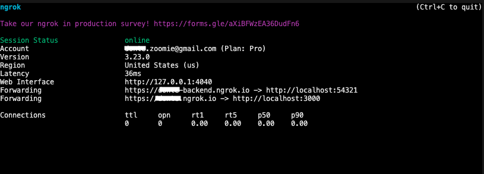

## Task Manager Zoom App sample

The Task Manager Zoom App is a multi-featured sample application that showcases core Zoom Developer Platform features, including Zoom Team Chat, chatbots, Zoom Apps SDK integration, and Zoom client deeplinking.

---

## Key features

* Supabase authentication
* Zoom Team Chat
* Zoom Team Chatbot
* Deep linking
* Zoom App SDK

## Tech stack

* Next.js
* Supabase
* Shadcn
* Tailwind CSS

## Prerequisites

* Node.js
* Next.js
* Ngrok (or another reverse proxy)

## Get started

### Install dependencies

```shell
npm i
```

### Start your Ngrok endpoints

Zoom Apps must be served over HTTPS and do not support `localhost`. To develop locally, tunnel traffic via HTTPS using Ngrok, as the app runs in Docker containers serving traffic from `http://localhost`. Once Ngrok is installed, run:

```shell
ngrok start nextjs supabase
```

Ngrok will output a tunnel origin (e.g., `https://9a20-38-99-100-7.ngrok.io`). Use this origin in your Zoom App configuration in the Zoom Marketplace web build flow. Also, set the `PUBLIC_URL` value in the `.env` file to this origin.

> **Note:** The Ngrok URL changes on each restart unless using a custom Ngrok Pro domain. If restarted, update the `.env` file and the Marketplace build flow accordingly.



### Set up the environment file

Use the `.env.example` file to create your environment configuration:

```shell
cp .env.example .env.local
```

Update `.env.local` with your credentials. For development, use the Client ID and Client Secret under "Development".


### Start your local Supabase instance

Run your local Supabase instance is running by executing

```shell
supabase start

```

### Run the development server

```shell
npm run dev
```

## Upload the manifest via terminal

### Source the environment file

To make `.env` variables available in your shell session:

```shell
source .env
```

### Upload the manifest

```shell
curl --request PUT \
  --url https://api.zoom.us/v2/marketplace/apps/$ZOOM_APP_ID/manifest \
  --header "Authorization: Bearer $TEMP_ZOOM_ACCESS_TOKEN" \
  --header "Content-Type: application/json" \
  --data @zoom-app-manifest.json && echo "Request successful" || echo "Request failed"
```

If the command returns an exit code of `0`, it will print “Request successful.” Otherwise, it will print “Request failed.”

## What do I do next?

Start building your app! You can check out the [Zoom Apps developer docs](https://developers.zoom.us/docs/zoom-apps/) for more information on the JS SDK. You can also explore the [Zoom REST API](https://developers.zoom.us/docs/api/) or use the third party OAuth to call a different API.